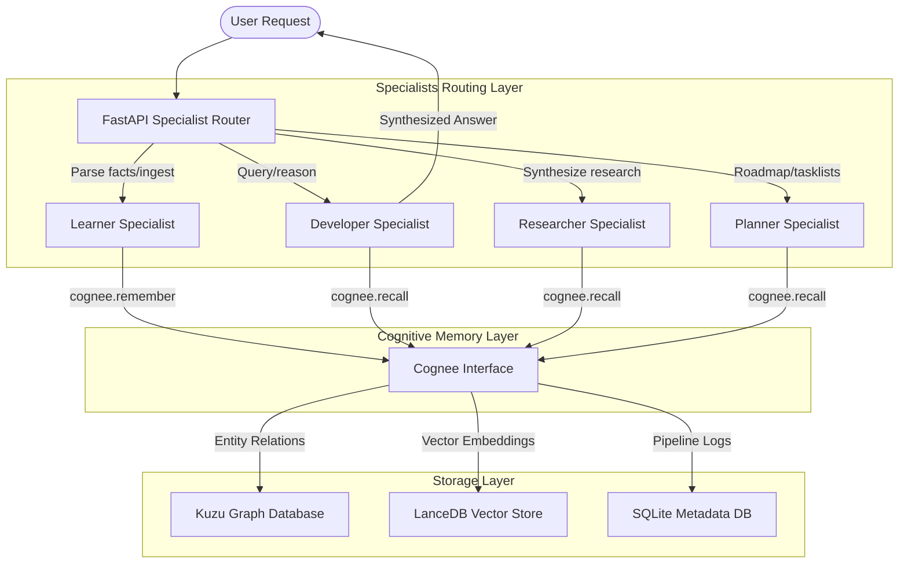
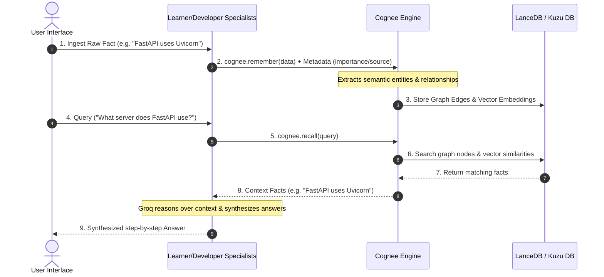

# MemoryOS Hackathon Submission Package

This artifact contains all the required documentation, FAQ, diagrams, and guide scripts for the **MemoryOS** release candidate (`v1.0.0`) submitted to the **Cognee Hackathon**.

---

## 1. System Architecture

The following diagram details the flow of data, specialist roles, and Cognee database interfaces in MemoryOS:



---

## 2. Memory Lifecycle Diagram

The lifespan of a memory fact inside MemoryOS goes through ingestion, graph representation, recall, and consolidation:



---

## 3. Demo Script

Follow this workflow to demonstrate MemoryOS during the hackathon pitch:

1. **Step 1: Start Server**
   ```bash
   docker-compose up --build
   ```
2. **Step 2: Access the UI**
   Open your browser to `http://localhost:8000`. Show the clean, dark-mode glassmorphic client workspace.
3. **Step 3: Learner Specialist Ingestion**
   * Paste: `"MemoryOS is built using FastAPI and integrates Cognee for graph relational memory."`
   * Select **Learner** and click **Ingest**.
   * Show the timeline update and the live Kuzu nodes rendering in the workspace graph view!
4. **Step 4: Developer Specialist Retrieval**
   * Ask: `"What framework and memory backend does MemoryOS use?"`
   * Select **Developer** and click **Ask**.
   * Show that the Developer Specialist outputs a fully synthesized answer by reasoning over the graph, citing the FastAPI/Cognee facts instead of dumping raw JSON.

---

## 4. Judge FAQ

* **Q: Why does MemoryOS use Cognee instead of plain vector RAG?**
  * *A: Plain vector search retrieves isolated text blocks. Cognee maps semantic concepts into a relational graph using Kuzu, allowing our specialists to trace connections (like dependencies, frameworks, and system options) that vector search alone would miss.*
* **Q: How are you managing API rate limits and costs?**
  * *A: We configure Cognee to handle vector embeddings locally or via efficient Gemini embedding calls, while reasoning is routed to the fast and affordable Groq API endpoints.*

---

## 5. API Documentation

### POST `/api/specialists/learner`
Ingest data into memory.
* **Request:** `{"text": "string", "session_id": "string"}`
* **Response:** `{"status": "remembered", "facts_extracted": [...], "memory_id": "..."}`

### POST `/api/specialists/developer`
Ask programming questions.
* **Request:** `{"query": "string", "session_id": "string"}`
* **Response:** `{"answer": "string", "context_used": [...]}`

---

## 6. Deployment Guide

1. **Prerequisites:**
   * Docker & Docker Compose
   * Gemini API Key (`GEMINI_API_KEY`)
   * Groq API Key (`GROQ_API_KEY`)
2. **Environment Configuration:**
   Create a `.env` file in the root directory:
   ```env
   GROQ_API_KEY=your_groq_key
   GEMINI_API_KEY=your_gemini_key
   ```
3. **Run:**
   ```bash
   docker-compose up --build
   ```
